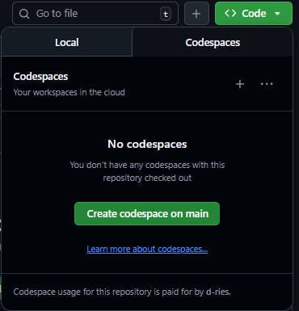

# Proef PE 1
## Voorbereiding
Open deze repository met GitHub Codespaces. Dit doe je door rechts bovenaan op de knop "code" te klikken en daarna op "Create codespace on main".

Dit opent een browser based visual studio code IDE. Je werkt de PE uit in deze IDE. 

Tijdens de opdracht mag je enkel gebruik maken van:
- Slides 
- Zelf gemaakte documentatie
- Het portaal van je Github repository
- De officiële Github actions documentatie op [https://docs.github.com/en/actions](https://docs.github.com/en/actions)
- De Github Codespaces Visual studio code IDE

Het gebruik van AI tools en plugins is niet toegestaan en wordt gezien als fraude. Toezichters zullen steekproefgewijs controleren of studenten enkel gebruik maken van het toegelaten materiaal. Het is niet toegestaan om extensies te installeren in de IDE.

## Opgave
Maak een nieuwe workflow aan met als naam `proef.yml`. Voorzie als trigger een handmatige start van de workflow.

Voeg een job toe met als naam "proefme" die start op een Ubuntu virtuele machine.

Voeg een stap toe die "Hogeschool PXL" print en het bestand <studentennummer>.txt aanmaakt.

## Indienen
- Doe een commit met als bericht "einde examen". 
- Doe 3 runs van je workflow. 
- Steek je hand op en de docent controleert of de inzending succesvol is.

Veel succes!